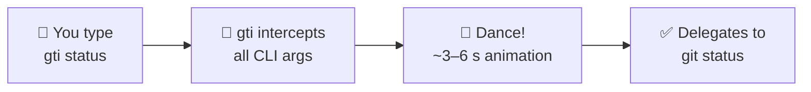

<div align="center">

# 🐢 gti

**The burnout-preventing speed governor for hyperactive terminal warriors.**

[](LICENSE)
[](https://www.rust-lang.org/)
[](https://github.com/risubrevis/gti/actions)
[]()

</div>

---

We've all been there: fingers flying across the mechanical keyboard, caffeine peaking, compiling code at lightspeed. And then... `gti status`.

Instead of throwing a cold, clinical `command not found` error that breaks your momentum and spikes your cortisol, **gti catches you**. It gently forces a 3-second *micro-relaxation* break. The screen clears, a beautiful ASCII animation of a dancing girl plays to ease your mind, and then — without you needing to re-type a single character — it smoothly delegates the exact arguments to the real `git`.

> Slow down, take a deep breath, watch the dance, and let the command run itself.

---

## ✨ How It Works



| Step | What happens |
|------|-------------|
| **Intercepts** | `gti` collects all CLI arguments you passed (e.g. `status`, `commit -m "msg"`). |
| **Dances** | One of the built-in dances is chosen at random. The terminal enters the alternate screen buffer, hides the cursor, and plays through all frames at the dance's native FPS (~3–6 s). Frames are pre-rendered ASCII art **embedded in the binary** at compile time. |
| **Delegates** | Restores the terminal to its original state and executes the real `git` with your arguments, inheriting `stdin`/`stdout`/`stderr`. |

### ⏩ Quick Exit

Press **`q`**, **`Esc`**, or **`Ctrl+C`** to skip the animation early if you're actually in a massive hurry. The terminal is always restored cleanly — even on panic — thanks to RAII guards with a `libc::tcsetattr` safety net.

---

## 📦 Install

### From Source

```bash
cargo build --release
ln -s "$(pwd)/target/release/gti" ~/.local/bin/gti
```

### Pre-built Packages (GitHub Releases)

Download the latest package for your platform from the [Releases page](https://github.com/risubrevis/gti/releases):

| Package | Platform |
|---------|----------|
| `.deb` | Debian / Ubuntu |
| `.rpm` | Fedora / RHEL |
| `.pkg.tar.zst` | Arch Linux |
| `.tar.gz` | macOS (x86_64 & Apple Silicon) |

---

## 🔨 Build

Make sure you have [Rust](https://www.rust-lang.org/tools/install) and Cargo installed, then:

```bash
cargo build --release
```

The build script (`build.rs`) **auto-discovers** `assets/*/dance.json` files and compiles all frame data into the binary. No manual configuration needed.

---

## 💃 Adding a New Dance

Adding custom dances is fully automated:

```bash
mkdir assets/dance3
cp new.gif assets/dance3/dance.gif
python3 scripts/convert.py assets/dance3/dance.gif assets/dance3/
cargo build --release
```

That's it — `build.rs` picks up the new dance automatically from `dance.json` on the next compilation.

> **Custom width:** `python3 scripts/convert.py ... --cols 60` — rows are automatically calculated from the aspect ratio to prevent image stretching.

### Re-generating Frames

If you replace a source GIF, just re-run the same `convert.py` command. It auto-detects dimensions, FPS, and frame count.

```bash
python3 scripts/convert.py assets/dance1/dance.gif assets/dance1/
python3 scripts/convert.py assets/dance2/dance.gif assets/dance2/ --cols 60
```

---

## 📂 Project Structure

```
gti/
├── Cargo.toml           ─ runtime + build dependencies
├── build.rs             ─ auto-discovers assets/*/dance.json, generates frame arrays
├── scripts/
│   └── convert.py        ─ GIF → ASCII + metadata (auto-detects everything)
├── assets/
│   ├── dance1/
│   │   ├── dance.gif     ─ source GIF (38 frames @ 12.5 FPS)
│   │   ├── dance.json    ─ auto-generated metadata
│   │   └── frame_*.txt   ─ ASCII art frames
│   └── dance2/
│       ├── dance.gif     ─ source GIF (60 frames @ 10 FPS)
│       ├── dance.json    ─ auto-generated metadata
│       └── frame_*.txt   ─ ASCII art frames
└── src/
    ├── main.rs           ─ entry point, Ctrl+C handler, animation → git
    ├── args.rs           ─ argument parsing and git delegation
    ├── terminal.rs       ─ TerminalGuard (RAII alternate screen + raw mode + safety net)
    └── animation.rs      ─ frame rendering, centring, random dance selection
```

---

## ☕ Support & Donations

If `gti` saved you from a micro-burnout or brought a smile to your terminal, consider throwing some crypto-dust to support the developer. Every satoshi, gwei, and piconero keeps the code clean and the dances smooth!

| Coin | Network | Address |
|------|---------|---------|
| **Monero** | XMR | `89tK9E9LbwdCsnnZGFMJzU7yBRGaQ7hfPTeNXWCe2LW3G7kCkJWswhb2ieBkHFrBs2JfdsmumQ3nY9obQ6fxb4HzHpTjCjd` |
| **Bitcoin** | BTC | `bc1qh0t2u7d7u0pl2yzmxuq80verhlfxuj0r29lfv7` |
| **USDT** | Polygon | `0xe1aAE089F1b0A3b2649017A7E7afa720877409C8` |
| **USDC** | Polygon | `0xe1aAE089F1b0A3b2649017A7E7afa720877409C8` |
| **USDT** | TRON | `TMkxXPuxamSci19rSygy58QRjZ9vmLjqtu` |
| **Ethereum** | Arbitrum | `0xe1aAE089F1b0A3b2649017A7E7afa720877409C8` |

---

<div align="center">

**[Report Bug](https://github.com/risubrevis/gti/issues) · [Request Feature](https://github.com/risubrevis/gti/issues) · [Releases](https://github.com/risubrevis/gti/releases)**

</div>